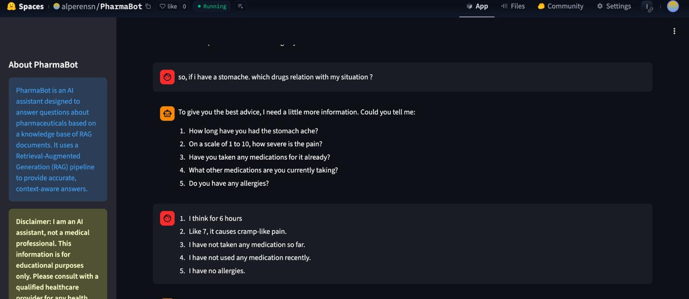
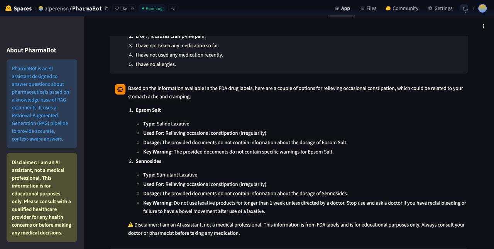

# 💊 Pharma-Bot: İlaç Bilgi Asistanı

Akbank Generative AI 101 Bootcamp için hazırlanmış, FDA (Amerikan Gıda ve İlaç Dairesi) ilaç etiket verilerini kullanan RAG (Retrieval-Augmented Generation) tabanlı bir chatbot projesi.

## Canlı Link

https://huggingface.co/spaces/alperensn/PharmaBot

## 📋 Proje Hakkında

Bu proje, kullanıcıların ilaçlar ve semptomlar hakkında sorular sorabileceği bir AI asistanı oluşturur. Asistan, FDA'in geniş ilaç veri setini kullanarak, kullanıcıların sorularına ilgili ilaç etiketlerinden bilgi çekerek yanıt verir. Proje, basit soru-cevap mekanizmasının ötesine geçerek, kullanıcının semptomlarını anlamak için ek sorular soran bir diyalog akışına sahiptir.

## �️ Kullanılan Teknolojiler

- **LlamaIndex**: RAG pipeline framework'ü
- **Streamlit**: Web arayüzü
- **Sentence Transformers**: Biyomedikal metinler için optimize edilmiş embedding modeli (`pritamdeka/S-BioBert-snli-multinli-stsb`)
- **Google Gemini**: Metin üretimi ve ajanın akıl yürütmesi için kullanılan model
- **LlamaIndex On-Disk Store**: Vektör veritabanı için dosya tabanlı saklama çözümü
- **openFDA**: Ham veri kaynağı

## 🚀 Kurulum

### 1. Gerekli Paketleri Yükleyin

```bash
# Virtual environment oluşturun (opsiyonel ama önerilir)
python -m venv .venv
# .venv\Scripts\activate  # Windows
# source .venv/bin/activate  # macOS/Linux

# Paketleri yükleyin
pip install -r requirements.txt
```

### 2. API Anahtarlarını Ayarlayın

Proje kök dizininde `.env` adında bir dosya oluşturun ve içine aşağıdaki anahtarları ekleyin:

```
GOOGLE_API_KEY="your_google_api_key_here"
HUGGING_FACE_TOKEN="your_huggingface_token_here"
```

- **Google API Key**: [Google AI Studio](https://makersuite.google.com/app/apikey) üzerinden ücretsiz olarak alabilirsiniz.
- **Hugging Face Token**: Embedding modelini indirirken hız limitlerine takılmamak için [Hugging Face Settings](https://huggingface.co/settings/tokens) üzerinden alabilirsiniz.

### 3. Uygulamayı Çalıştırın

Aşağıdaki komutu terminalde çalıştırarak uygulamayı başlatın:

```bash
streamlit run app.py
```

Uygulama, tarayıcınızda otomatik olarak açılacaktır (genellikle http://localhost:8501).

## 📁 Proje Yapısı

```
.
├── app.py                     # Streamlit arayüzünü çalıştıran ana dosya
├── rag_pipeline.py            # LlamaIndex RAG pipeline ve Agent mantığı
├── data_processing.py         # Temizlenmiş veriyi işleyip Document nesnelerine dönüştürür
├── dataOrganize.py            # Ham JSON verisini temizler ve düzenler
├── build_knowledge_base.py    # Bilgi tabanını (vektör deposu) oluşturan script
├── config.py                  # Model ID'leri ve dosya yolları gibi ayarlar
├── requirements.txt           # Gerekli Python kütüphaneleri
├── .env                       # API anahtarları (git'e eklenmez)
├── fda_data/                  # Ham ve işlenmiş FDA verilerinin bulunduğu klasör
│   ├── drug_labels_all.json
│   └── fda_data_processed.jsonl
└── llamaIndexVectorBase_fda/  # Oluşturulan vektör veritabanının saklandığı klasör
```
## �️ Veri Seti ve İşleme Süreci

Bu proje, **openFDA** tarafından sağlanan ve ABD'deki ilaçların etiket bilgilerini içeren halka açık veri setini kullanır. Ham veri, on binlerce ilacın endikasyonları, yan etkileri, dozajları ve uyarıları gibi zengin bilgiler içeren karmaşık bir JSON yapısındadır. RAG modelinin bu veriyi etkin bir şekilde kullanabilmesi için aşağıdaki adımlardan oluşan bir veri işleme boru hattı (`dataPrep.py`) uygulanmıştır:

1.  **Veri Filtreleme ve Temizleme**:
    *   Ham veri (`drug_labels_all.json`) yüklenir.
    *   Marka (`brand_name`) veya jenerik isme (`generic_name`) sahip olmayan ya da ilacın kullanım amacını belirten "indications_and_usage" gibi kritik bir bölüme sahip olmayan düşük kaliteli kayıtlar elenir.
    *   Metin içeriğindeki "REVISED: AA/YYYY" gibi gürültülü veriler ve gereksiz boşluklar temizlenir.

2.  **Tekilleştirme (Deduplication)**:
    *   Aynı ilaca ait birden fazla kaydın bulunmasını önlemek için marka ve jenerik isme göre tekilleştirme yapılır. Bu, bilgi tabanının daha tutarlı ve verimli olmasını sağlar.

3.  **Formatlama ve Yapılandırma**:
    *   Temizlenmiş ve tekilleştirilmiş veriler, her bir satırın tek bir ilaç bölümünü (örneğin, bir ilacın "Yan Etkileri" bölümü) temsil ettiği bir **JSON Lines (.jsonl)** formatına (`fda_data_processed.jsonl`) dönüştürülür.
    *   Her kayıt, `doc_id`, `generic_name`, `section` (bölüm başlığı) ve `content` (içerik) gibi alanları içeren yapılandırılmış bir formata getirilir.

    **Örnek JSON Line Çıktısı:**
    ```json
    {
        "doc_id": "IBUPROFEN_adverse_reactions",
        "generic_name": "IBUPROFEN",
        "section": "Adverse Reactions",
        "content": "The most frequent type of adverse reaction occurring with ibuprofen is gastrointestinal..."
    }
    ```

Bu süreç sonunda, RAG pipeline'ı için optimize edilmiş, temiz ve yapılandırılmış bir bilgi kaynağı oluşturulur. `data_processing.py` script'i bu son dosyayı okuyarak LlamaIndex `Document` nesneleri oluşturur ve bilgi tabanının temelini atar.

## 💡 Nasıl Çalışır?

1.  **Veri Organizasyonu**: `dataOrganize.py` script'i, ham `drug_labels_all.json` dosyasını okur, gereksiz bilgileri temizler ve RAG için uygun bir formatta `fda_data_processed.jsonl` olarak kaydeder.
2.  **Bilgi Tabanı Oluşturma**: `build_knowledge_base.py` script'i `fda_data_processed.jsonl` dosyasını okur.
3.  **Embedding**: Her ilaç bilgisi, BioBert embedding modeli ile vektörlere dönüştürülür.
4.  **Vektör Veritabanı**: Bu vektörler, LlamaIndex kullanılarak disk üzerinde `llamaIndexVectorBase_fda/` klasöründe saklanır.
5.  **Diyalog Yönetimi**: Kullanıcı bir soru sorduğunda, `ReActAgent` devreye girer.
    - Eğer soru tıbbi bir soru ise, agent durumu anlamak için ek sorular sorar.
    - Yeterli bilgi topladığında, bilgi tabanını sorgulamak için bir araç (`tool`) kullanır.
6.  **Yanıt Üretimi**: Gemini modeli, bilgi tabanından gelen verileri ve diyalog geçmişini kullanarak, bir doktorun hastasıyla konuşuyormuş gibi bir yanıt oluşturur.

## 🎯 Örnek Sorular

- "Aspirin'in yan etkileri nelerdir?"
- "Ibuprofen ve Parasetamol arasındaki farklar nelerdir?"
- "Başım ağrıyor ve midem bulanıyor." (Bu tür bir girdi, agent'ın size ek sorular sormasını tetikleyecektir.)

## ⚠️ Önemli Notlar

- Uygulama ilk kez çalıştığında, `fda_data_processed.jsonl` dosyasından bilgi tabanını oluşturacaktır. Bu işlem, bilgisayarınızın performansına bağlı olarak birkaç dakika sürebilir.
- Sonraki çalıştırmalarda, uygulama mevcut bilgi tabanını kullanacağı için çok daha hızlı başlayacaktır.
- Proje, tıbbi tavsiye vermek yerine, yalnızca FDA verilerine dayalı olarak bilgi sunar. Her yanıtın sonunda yasal bir uyarı metni bulunur.

## 📈 Örnek Kullanım Senaryosu

PharmaBot'a bir senaryo sunuldu ve farmasötiklerle ilgili bilgi sağlama yeteneği değerlendirildi.

### Senaryo: Karın Ağrısı ve Kabızlık
**Giriş:** Kullanıcı, karın ağrısı şikayetiyle ilgili olarak hangi ilacın uygun olduğunu sordu.

**PharmaBot'un Yanıtı (Öneri 1):** PharmaBot, kullanıcıdan daha fazla bilgi talep ederek durumun daha iyi anlaşılmasını sağladı. İstenen bilgiler şunlardı:
- Karın ağrısının ne kadar süredir devam ettiği.
- Ağrının şiddeti (1-10 arası bir ölçekte).
- Daha önce herhangi bir ilaç alınıp alınmadığı.
- Şu anda kullanılan başka ilaçlar olup olmadığı.
- Herhangi bir alerjinin olup olmadığı.



**Kullanıcı bu bilgilere yanıt verdi:**
- 6 saattir devam ediyor.
- Şiddet 7, kramp benzeri bir ağrı.
- Şu ana kadar ilaç alınmadı.
- Son zamanlarda herhangi bir ilaç kullanılmadı.
- Alerjisi yok.

**PharmaBot'un Yanıtı (Öneri 2):** Elde edilen bilgilere dayanarak, PharmaBot FDA etiketlerinde bulunan bilgilere göre ara sıra kabızlık için seçenekler sundu (ki bu da karın ağrısı ve kramp ile ilişkili olabilir):



**Epsom Tuzu (Salin Laksatif):**
- **Kullanım Amacı:** Ara sıra kabızlığı gidermek için.
- **Dozaj:** Sağlanan belgeler Epsom Tuzu dozu hakkında bilgi içermiyor.
- **Ana Uyarı:** Sağlanan belgeler Epsom Tuzu için belirli uyarılar içermiyor.

**Sennosid (Uyarıcı Laksatif):**
- **Kullanım Amacı:** Ara sıra kabızlığı gidermek için.
- **Dozaj:** Sağlanan belgeler Sennosid dozu hakkında bilgi içermiyor.
- **Ana Uyarı:** Laksatif ürünlerini bir haftadan uzun süre kullanmayın ve rektal kanamanız varsa veya laksatif kullandıktan sonra bağırsak hareketinde başarısızlık yaşarsanız bir doktora danışın.

**PharmaBot'un Yanıtı (Bilgilendirme):** Bahsi geçen ilaçla ilgili eldeki verileri okuyup kullanıcıya anlayacağı bir versiyonda bilgilendirme olarak sundu.


**Sonuçlara Dayalı Analiz:** PharmaBot, kullanıcıdan gerekli bilgileri toplayarak mantıklı bir teşhis sürecini takip etti. Ardından, karın ağrısının olası bir nedeni olan kabızlığa yönelik ilaç seçeneklerini FDA etiket bilgilerine dayanarak sundu. Dozaj ve spesifik uyarılar hakkında bilgi eksikliği not edildi, bu da modelin sadece mevcut RAG belgeleriyle sınırlı olduğunu gösteriyor.

## 🐛 Sorun Giderme

### ModuleNotFoundError hatası alıyorum
Proje için oluşturduğunuz sanal ortamın (virtual environment) aktif olduğundan emin olun ve aşağıdaki komutu tekrar çalıştırın:
```bash
pip install -r requirements.txt
```

### API anahtarı hatası alıyorum
`.env` dosyasının doğru formatta olduğundan ve `GOOGLE_API_KEY` anahtarını içerdiğinden emin olun.

### Embedding işlemi çok yavaş veya bellek hatası veriyor
- Bilgisayarınızda yeterli RAM olduğundan emin olun. Embedding işlemi bellek tüketebilir.
- Gerekirse, `dataOrganize.py` script'inde işlenen veri miktarını azaltarak daha küçük bir bilgi tabanı oluşturmayı deneyebilirsiniz.

## 📝 Lisans
Bu proje eğitim amaçlıdır ve MIT Lisansı altında lisanslanmıştır.

